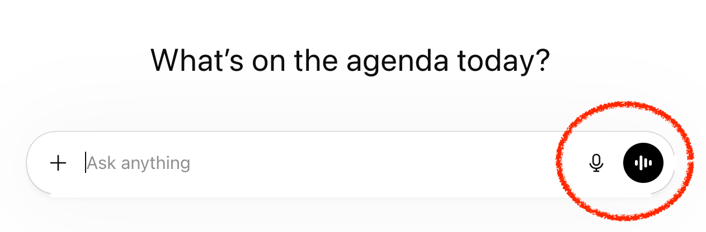
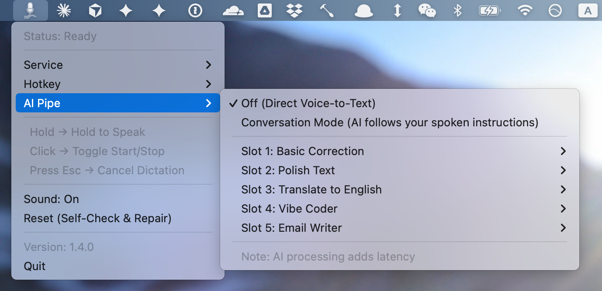

# MicPipe 

Current version: `v1.5.1`


[中文](README.zh-CN.md)

> ⚠️ **Actively evolving**: Core functionality has been validated, but some edge cases and stability still need improvement. Feedback, code contributions, and a Star are very welcome.

> **Tip**: Before using MicPipe, sign in to ChatGPT in Chrome to ensure the built-in voice dictation works properly.

## Overview

MicPipe is a small macOS utility that lets you use ChatGPT's web-based voice dictation feature directly within any application.

[📺 Watch Demo Video](demo/demo1.mp4)


### Key features
- **Dictation, two trigger styles**: Use **hold to speak** or **click to toggle** for one-shot speech-to-text
- **AI Pipe for dictation**: Automatically post-process transcribed text through AI using preset prompts such as Grammar Fix, Email Writer, and Vibe Coder
- **Direct AI mode for dictation**: Send spoken input to the AI without a preset prompt when you want free-form commands instead of a fixed rewrite step
- **Editable dictation slots**: Customize titles and prompts for up to 5 processing slots directly from the menu
- **Realtime voice chat**: Press **Control + Fn** to start ChatGPT's realtime voice conversation mode. Press **Fn** again or **Esc** to end.
- **Customizable dictation hotkey**: Select your preferred trigger key from the menu (defaults to Fn)
- **Invisible dedicated window**: The service runs in a hidden Chrome window to reduce flickering and avoid interfering with your normal browsing
- **Press Esc to cancel dictation**: Cancel recording without pasting anything
- **State persistence**: Your settings (chosen service, sound, hotkey, and custom AI prompts) are automatically saved and restored on startup
- **Clipboard preservation**: Automatically restores your original clipboard content after pasting

### How it works

MicPipe does not implement its own speech recognition or voice engine. Instead, it keeps a dedicated hidden Chrome window pointed at ChatGPT and programmatically clicks the same two ChatGPT controls you would click yourself:

- **Dictate** for one-shot speech-to-text
- **Voice** for realtime voice conversation

That is the core idea of the app: reuse ChatGPT's existing web UI, but make it available system-wide through a lightweight macOS menu bar app and global shortcuts.



MicPipe then handles the desktop glue around those actions: managing the hidden window, triggering the right button at the right time, pasting transcribed text back into your current app, and preserving your clipboard.


## Requirements

- macOS 10.14+
- Python 3.11+
- Google Chrome (must enable JavaScript from Apple Events, see below)

## Quick Start

### Option 1: Command Launch (Recommended)
Double-click **`MicPipe.command`**. This script will launch the app in the background and automatically close the terminal window. It is the most reliable way to ensure the app has necessary permissions.

### Option 2: Manual Launch
```bash
uv sync
uv run python micpipe.py
```

## Installation

### 1. Install dependencies

- Python 3.11+
- Google Chrome
- `uv` (Python package manager)

Then initialize the project environment:

```bash
uv sync
```

### 2. Configure Chrome (important)

Enable **Allow JavaScript from Apple Events** in Chrome:

1. Open Chrome
2. Go to menu bar: **View** → **Developer** → **Allow JavaScript from Apple Events**
3. Make sure this option is checked ✓

> ⚠️ If you don't see this option, ensure you're using the official Google Chrome (not Chromium).

### 3. Run the app

- **MicPipe.command**: Double-click to run. This script handles permissions more reliably and will auto-close the terminal window once the app is running in the background (recommended).
- **Terminal**: Run `uv run python micpipe.py`.

> **Note for first-time use**: Since this is an unsigned app, macOS might block it. If so, **Right-click** `MicPipe.command` and select **Open**, then click **Open** again in the warning dialog.

## Usage

MicPipe uses the **Fn key** to trigger recording, with two operation modes:

### Hold Mode (hold to speak)

1. **Hold Fn** to start recording (menu bar icon turns red)
2. Speak...
3. **Release Fn** to stop and transcribe
4. Transcribed text is automatically pasted into the original app

### Toggle Mode (click to toggle)

1. **Quick tap Fn** to start recording
2. Speak...
3. **Tap Fn again** to stop and transcribe
4. Transcribed text is automatically pasted into the original app

### Voice Conversation (ChatGPT only)

1. Press **Control+Fn** to start a real-time voice conversation with ChatGPT
2. ChatGPT will listen and respond with voice — no text pasting involved
3. Press **Fn** again or **Esc** to end the conversation

> ⚠️ Voice Conversation requires **ChatGPT Plus** and is only available when the service is set to ChatGPT.

### Voice CLI

Use the CLI when you want to trigger voice mode from **Shortcuts** or **Siri**:

```bash
uv run micpipe voice start
uv run micpipe voice stop
uv run micpipe voice toggle
```

For automation, prefer **`start`** and **`stop`** because they are idempotent. `toggle` is mainly useful for manual scripting.

For **Shortcuts** on macOS, the simplest setup is:

1. Create one shortcut named `Start ChatGPT Voice`
2. Create another shortcut named `Stop ChatGPT Voice`
3. In each shortcut, add **Run Shell Script**
4. Use a script like this:

```bash
cd path-to-micpipe
path-to-micpipe/.venv/bin/python path-to-micpipe/micpipe.py voice start
```

or for stop:

```bash
cd path-to-micpipe
path-to-micpipe/.venv/bin/python path-to-micpipe/micpipe.py voice stop
```

5. Say the shortcut name directly to Siri

MicPipe must already be running in the menu bar for these commands to work.

### Cancel Recording

- Press **Esc** during recording to cancel
- Canceling will not paste any text

### Menu Bar Icon Status

- 🎙️ Microphone icon: Idle
- 🔴 Pulsing red: Recording / dictation in progress
- 🟣 Pulsing voice icon: ChatGPT realtime voice conversation is active
- ⚙️ Circle icon: Transcribing

Click the menu item to toggle sound cues.

<p align="left">
  
</p>


### Custom Hotkey

You can choose your preferred trigger key directly from the menu:

1. Click the **MicPipe** icon in the menu bar.
2. Go to **Hotkey**.
3. Select from supported keys: **Fn**, **Left/Right Option**, or **Left/Right Shift**.

The setting is saved automatically and takes effect immediately.
 
## AI Pipe (AI Post-Processing)

AI Pipe allows you to automatically process your voice transcription through AI before pasting it. You can use it to fix grammar, rewrite text into a formal email, or organize coding instructions.
 
> ⚠️ **Note**: Currently, AI Pipe features (including Conversation Mode and Preset Prompts) are only supported for **ChatGPT**. Gemini currently only supports standard voice-to-text.

### How to Use

1. Click the **MicPipe** icon → **AI Pipe**
2. Select your preferred mode:
   - **Off**: Standard voice-to-text with no AI processing.
   - **Conversation Mode**: Sends your voice directly to the AI as a request or command.
   - **Slot 1-5 (Presets)**: Uses a pre-defined prompt to process your text.

### Customizing Your Presets

You can customize the 5 preset prompts to fit your needs:

1. In the **AI Pipe** menu, hover over the slot you want to change.
2. Select **✎ Edit...**.
3. A standalone editor will open where you can change the **Title** and the **Prompt**.
4. Save your changes, and they will be applied automatically to your next recording.

## Service Selection (ChatGPT / Gemini)

You can switch between transcription services via the menu bar:

1. Click the **MicPipe** icon in the menu bar.
2. Go to **Service**.
3. Select **ChatGPT** or **Gemini**.

- **ChatGPT**: Supports full features including "Cancel" (Esc).
- **Gemini**: Supports dictation, but does not currently support the "Cancel" (Esc) key due to technical limitations of the Gemini web interface.

## Permissions (important)

The following permissions are required on first run:

### 1. Accessibility (required)

- **Purpose**: Listen for Fn hotkey, simulate `Cmd+V` paste
- **Location**: System Settings → Privacy & Security → Accessibility
- Add and enable the terminal app running MicPipe (e.g., Terminal, iTerm2)

### 2. Automation > Google Chrome (required)

- **Purpose**: Control the ChatGPT tab in Chrome via AppleScript
- **Location**: System Settings → Privacy & Security → Automation
- Ensure your terminal app has permission to control Google Chrome

### 3. Microphone (required in Chrome)

- **Purpose**: ChatGPT dictation requires microphone access
- **Location**: Chrome will prompt for permission on first use; click Allow

## How it works (technical)

- Captures the frontmost app at the moment recording starts.
- One hotkey, two behaviors: **Hold Fn** to record (hold mode), **release Fn** to stop (auto transcribe).
- Uses AppleScript/JavaScript to control the ChatGPT tab in Chrome:
  - Click “Dictate” to start
  - Click “Submit Dictation” to stop and retrieve text
  - Click “Stop Dictation” to cancel on Esc
- Restores focus to the original app and simulates `Cmd+V` to paste.
- A short WAV sound is played on start/stop when enabled.

### Why this approach?

We explored several technical paths before settling on the current AppleScript bridge:
- **Option A: CDP (Chrome DevTools Protocol)** — Failed. ChatGPT's anti-bot protection (Cloudflare/Turnstile) detects CDP and triggers verification challenges, preventing regular usage.
- **Option B: Headless Browsers (Puppeteer/Playwright)** — Failed. The main blocker is the **inability to access the microphone** in headless mode, along with bot detection issues.

**The Solution**: Using AppleScript to interact with your daily Google Chrome window.
- **Pros**: It leverages your existing login session and microphone permissions in a real browser environment, effectively bypassing bot detection.
- **Limitation**: Because it relies heavily on macOS-specific AppleScript and Quartz APIs, this project is **not cross-platform**. Implementations for Linux or Windows would require separate developement based on similar automation principles.

## Compatibility

- macOS 10.14+
- Python 3.11+
- Google Chrome

## License

This project is licensed under the **GNU General Public License v3 (GPLv3)**. See the [LICENSE](LICENSE) file for details.
